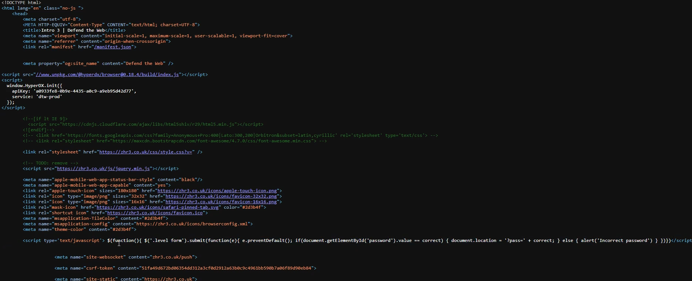

# Intro 3

## Assignment

We've been given just a password field. We need to find the correct password in order to complete this challenge.

## Analyze

In the name of challnge is "Javascript" so lets maybe take a look on page source code if we can find anything interesting. After opening source code by pressing <mark style="color:orange;">CTRL+U</mark> we can already see at the line 44 the script we've been searching for. Right?

<figure><figcaption>
line 44
</figcaption></figure>

Practically yes but we don't know the password yet. Only how it processes the password. It tells us `if(document.getElementById('password').value == correct` this means that it will compare our input with a variable called _correct._ But where do we find the value of the variable correct? We can simply try searching it by pressing <mark style="color:purple;">CTRL+F</mark> and typing _correct_ and we get our results.

## Findings

In this walkthrough we learned a little about Javascript, how to quickly search for value using CTRL+F and how to view source code by pressing CTRL+U.

